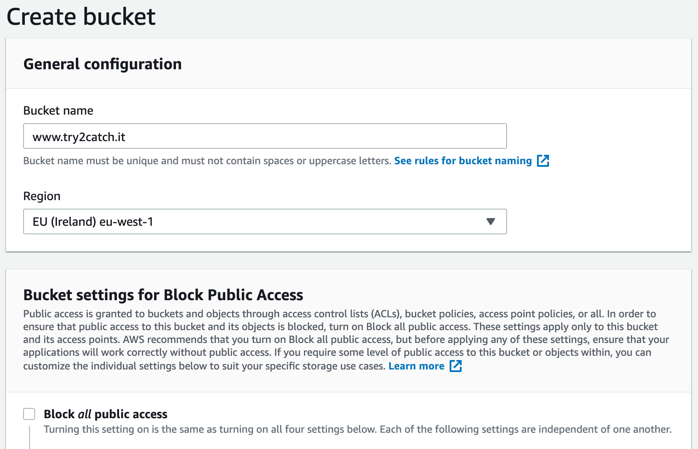
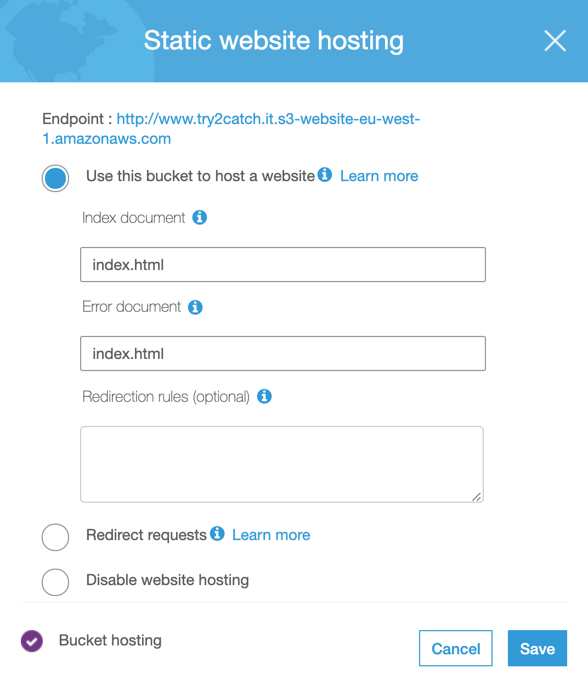
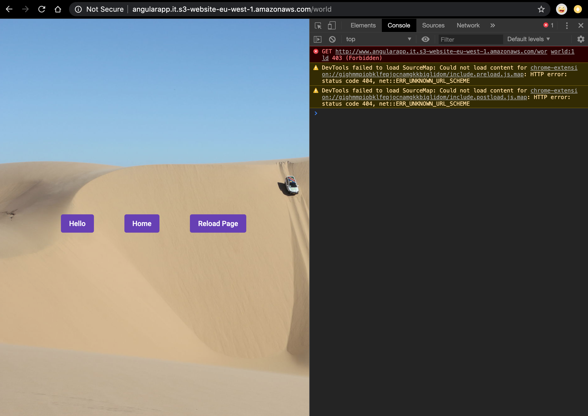

# AngularApp
This project provides a simple guide of how to deploy and angular application on AWS S3.

```generated with Angular CLI version 9.1.7.```

## Deployment steps
To deploy the application follow the steps belows:

### 0. System requirements

Make sure to have:
 - [nodeJs](https://nodejs.org/en/download/)
 - [angular-cli](https://angular.io/cli)  
 - [AWS cli](https://docs.aws.amazon.com/cli/latest/userguide/cli-chap-install.html)

installed on you machine. 
After installing the AWS CLI yuo will need to configure it 
by following these [steps](https://docs.aws.amazon.com/cli/latest/userguide/cli-chap-configure.html).

### 1. Run the application locally

- Run `npm install` to install all required dependencies
- Run `ng serve` for a dev server.
- Navigate to `http://localhost:4200/` and check the app is working

## 2. Create a new bucket for the application

Remember to disable the block of all public access



## 3. Configure your bucket

Setup the index and the error page to be index.html of your application



having the error page pointing to the index page, it will allow to correctly handle the Angular routing mechanism when reloading the page even if the requested path do not exits on S3.

## 4. Build the project

 - Run `ng build --prod` to build the project (Use the `--prod` flag for a production build). 
 - The build artifacts will be stored in the `dist/` directory.

## 5. Deploy your code

execute the deploy script with your bucket name:

``sh deploy.sh [BUCKET-NAME]``

like in the example below:

``sh deploy.sh www.angularapp.it``

## 5. Deploy your code

The application is now available directly from the public AWS Region-specific 
website endpoint of the bucket

http://[BUCKET-NAME].s3-website-[AWS-REGION].amazonaws.com

For example:

[http://www.angularapp.it.s3-website-eu-west-1.amazonaws.com](http://www.angularapp.it.s3-website-eu-west-1.amazonaws.com)

## 5 You can test the application with the following links

- open the home page [HOME](http://www.angularapp.it.s3-website-eu-west-1.amazonaws.com)
- navigate to the page [WORLD](http://www.angularapp.it.s3-website-eu-west-1.amazonaws.com/world)
- try to reload the page, everything should work just fine even if 
AWS S3 send us back and error 403 (Forbidden). 

This is happening because the file `/home` does not exists in our bucket.
So S3 is answering with an error but thanks to our bucket configuration
it also loads the `index.html` that is the entry point of our application, 
so that Angular handle the correct routing to our page.


